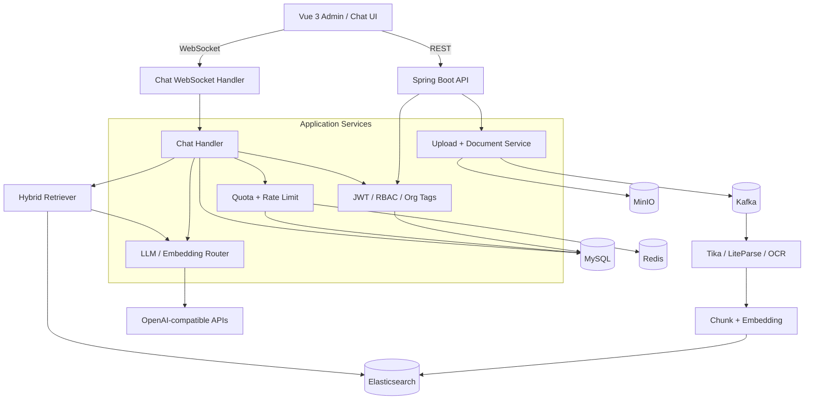
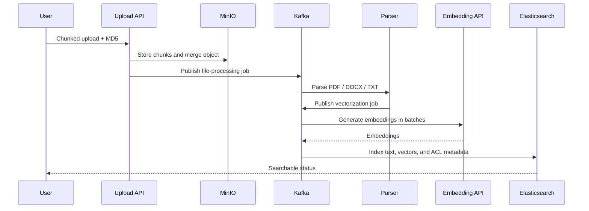

<div align="center">


# EwanSmart

<p><strong>English</strong> · <a href="README.zh-CN.md">简体中文</a> · <a href="README.zh-Hant.md">繁體中文</a></p>

### A full-stack RAG knowledge platform for grounded answers and AI operations

[](https://spring.io/projects/spring-boot)
[](https://vuejs.org/)
[](https://www.elastic.co/)
[](LICENSE)

EwanSmart covers the complete path from chunked uploads, asynchronous parsing, embeddings, and hybrid retrieval to source-grounded WebSocket streaming. Multi-tenant access control, model routing, token quotas, rate limits, and operational dashboards live in the same system.

[Live System](#live-system) · [Architecture](#architecture) · [Core Flows](#core-flows) · [Run Locally](#run-locally)

</div>

## Live System

Every screen below comes from a real local deployment of this repository. The Spring Boot backend is connected to MySQL, Redis, Kafka, MinIO, and Elasticsearch; the Vue frontend communicates over REST and WebSocket; and the system has completed real model calls. Provider keys are shown only in their server-masked form.

### Usage and risk at a glance


After a real conversation, the platform records messages, LLM tokens, request counts, quota warnings, trends, and user rankings. Runtime limits are persisted by the backend and apply to new requests immediately after they are saved.

<table>
  <tr>
    <td width="50%"></td>
    <td width="50%"></td>
  </tr>
  <tr>
    <td align="center"><b>Model routing</b><br>Provider, model, endpoint, encrypted key, and connectivity test</td>
    <td align="center"><b>Grounded RAG</b><br>Refuses to invent an answer when the knowledge base has no evidence</td>
  </tr>
</table>

<details>
<summary>View the login, runtime guardrails, and knowledge-base screens</summary>


</details>

## What It Solves

Many RAG demos stop after inserting text into a vector store and asking one question. EwanSmart implements the application around that demo:

| Domain | Implementation |
| --- | --- |
| Document lifecycle | Chunked upload, MD5 deduplication, merge, parsing, chunking, embedding, progress tracking, download, and preview |
| Retrieval and answers | Keyword + vector hybrid retrieval, context assembly, source mapping, and WebSocket streaming |
| Async reliability | Kafka decouples file processing from vectorization, with separate consumers and dead-letter queues |
| Multi-tenancy | Users, organization tags, primary organizations, public/private documents, and access-scope filtering |
| Model governance | Admin-managed LLM/embedding providers, encrypted secrets, dynamic routing, and guarded provider changes |
| Cost governance | User balances, daily quotas, global token budgets, rate limits, alerts, rankings, and trends |
| Platform operations | Invite codes, registration modes, admin bootstrap, recharge plans, and optional WeChat Pay |

## Architecture



## Core Flows

### From document to knowledge base



### A grounded answer

```text
User question
  -> Validate identity and organization scope
  -> Run keyword and vector retrieval in parallel
  -> Fuse results and assemble context
  -> Check token budget and rate limits
  -> Stream the LLM response
  -> Map citations, persist the conversation, and account for usage
```

When retrieval finds no trustworthy evidence, the platform returns "No relevant information" instead of asking the model to fill in the gaps. The behavior is visible in the real chat screenshot above.

## Technology

| Layer | Stack |
| --- | --- |
| Backend | Java 17, Spring Boot 3.4, Spring Security, Spring Data JPA, WebFlux, WebSocket |
| Frontend | Vue 3.5, TypeScript, Vite 6, Naive UI, Pinia, UnoCSS, ECharts |
| Data | MySQL 8, Redis, Elasticsearch 8.10 |
| Messaging and object storage | Kafka, MinIO |
| Document processing | Apache Tika, LiteParse, Tesseract, optional Alibaba Cloud OCR |
| Models | OpenAI-compatible LLM and embedding providers |

## Design Decisions

### Provider APIs never return plaintext keys

The admin API returns keys only as masks such as `sk-****xxxx`. A new key is encrypted with AES-GCM before it reaches the database; an empty update preserves the existing value. Embedding-provider changes validate index dimensions and re-embedding risk so an admin cannot silently break the knowledge base with one click.

### Authorization happens before retrieval

Documents carry `userId`, `orgTag`, and `isPublic`. The server constructs the accessible file scope before searching instead of retrieving everything and hiding unauthorized results in the browser. Private knowledge therefore never enters the model context.

### Rate limiting is more than QPS

The platform separately constrains chat messages, global LLM tokens per minute/day, embedding upload tokens, embedding query counts, and query tokens. MySQL stores usage details, Redis holds short-lived counters, and the admin dashboard turns both into alerts and rankings.

## Run Locally

### Requirements

- JDK 17+
- Maven 3.9+
- Node.js 18.20+
- pnpm 8.7+
- Docker Desktop / Docker Compose

### 1. Start infrastructure

```bash
git clone https://github.com/xuytwinter/EwanSmart.git
cd EwanSmart
docker compose -f docs/docker-compose.yaml up -d
docker compose -f docs/docker-compose.yaml ps
```

Compose starts and initializes MySQL, Redis, Kafka, MinIO, and Elasticsearch. Elasticsearch installs the IK plugin on its first launch, so it may take a while to become healthy.

### 2. Configure the backend

```bash
# macOS / Linux
cp .env.example .env

# Windows PowerShell
Copy-Item .env.example .env
```

Match the infrastructure values in `.env` to the Compose environment and configure the model providers:

```dotenv
SPRING_DATASOURCE_PASSWORD=EwanSmart2025
SPRING_DATA_REDIS_PASSWORD=EwanSmart2025

MINIO_ENDPOINT=http://localhost:19000
MINIO_PUBLIC_URL=http://localhost:19000
MINIO_ACCESS_KEY=admin
MINIO_SECRET_KEY=EwanSmart2025

ELASTICSEARCH_SCHEME=http
ELASTICSEARCH_USERNAME=elastic
ELASTICSEARCH_PASSWORD=EwanSmart2025
ELASTICSEARCH_INSECURE_TRUST_ALL_CERTIFICATES=false

# Must be a Base64-encoded random 32-byte value
JWT_SECRET_KEY=replace-with-openssl-rand-base64-32

DEEPSEEK_API_URL=https://api.deepseek.com/v1
DEEPSEEK_API_MODEL=deepseek-chat
DEEPSEEK_API_KEY=your-llm-api-key

EMBEDDING_API_URL=https://dashscope.aliyuncs.com/compatible-mode/v1
EMBEDDING_API_MODEL=text-embedding-v4
EMBEDDING_API_KEY=your-embedding-api-key
```

Generate a local secret:

```bash
openssl rand -base64 32
```

The repository's `DotenvEnvironmentPostProcessor` automatically loads `.env` from an IDE, an executable JAR, or `mvn spring-boot:run`.

### 3. Start the backend

```bash
mvn spring-boot:run
```

The backend listens on `http://localhost:8081` by default. For the first deployment, temporarily enable admin bootstrap:

```dotenv
ADMIN_BOOTSTRAP_ENABLED=true
ADMIN_BOOTSTRAP_USERNAME=admin
ADMIN_BOOTSTRAP_PASSWORD=replace-with-a-strong-password
ADMIN_BOOTSTRAP_PRIMARY_ORG=default
ADMIN_BOOTSTRAP_ORG_TAGS=default,admin
```

Set `ADMIN_BOOTSTRAP_ENABLED=false` and remove the bootstrap password from `.env` immediately after the account is created.

### 4. Start the frontend

```bash
cd frontend
pnpm install
pnpm dev
```

Open `http://localhost:9527`. For a production build:

```bash
pnpm typecheck
pnpm build
```

## Configuration Map

| Group | Purpose |
| --- | --- |
| `APP_AUTH_*` / `ADMIN_BOOTSTRAP_*` | Registration, invite codes, and the initial administrator |
| `SECURITY_ALLOWED_ORIGINS` | REST/WebSocket origin allowlist |
| `RATE_LIMIT_*` / `USAGE_QUOTA_*` | Request and token budgets |
| `KNOWLEDGE_BOOTSTRAP_*` | Import bundled knowledge documents at startup |
| `FILE_PARSING_*` / `ALIYUN_OCR_*` | PDF parsing and OCR |
| `AI_GENERATION_*` | Temperature, max tokens, and top-p |
| `WX_PAY_*` | WeChat Pay and recharge feature flags |

See `src/main/resources/application.yml` and `.env.example` for the complete defaults.

## Test and Build

```bash
# Backend tests and package
mvn test
mvn package

# Frontend type checking and production build
cd frontend
pnpm typecheck
pnpm build
```

The repository also includes a WebSocket reconnection smoke test and frontend Playwright scenarios. Full RAG end-to-end tests require the Compose infrastructure and model services to be running.

## Interview Talking Points

1. Why the upload pipeline is split across MinIO, Kafka, parsing, and vectorization.
2. How hybrid retrieval works together with user, organization, and public-document scopes.
3. Why LLM provider switching is permissive while embedding provider switching is guarded.
4. How streamed WebSocket messages stay consistent with persistence and token accounting.
5. Which distinct problems minute rate limits, daily quotas, and user balances solve.
6. How duplicate uploads, retries, dead-letter queues, and index rebuilds are handled.

## Production Checklist

- Replace sample Compose passwords and restrict public access to infrastructure ports.
- Supply JWT, model, and payment credentials through protected environment variables or a secret manager.
- Restrict `SECURITY_ALLOWED_ORIGINS` to production domains and enable HTTPS plus WebSocket forwarding at the reverse proxy.
- Disable insecure Elasticsearch certificate trust and establish backup plans for MySQL, MinIO, and indices.
- Exercise dead-letter queues, upload limits, rate-limit alerts, and recovery procedures.

## License

[MIT](LICENSE)
