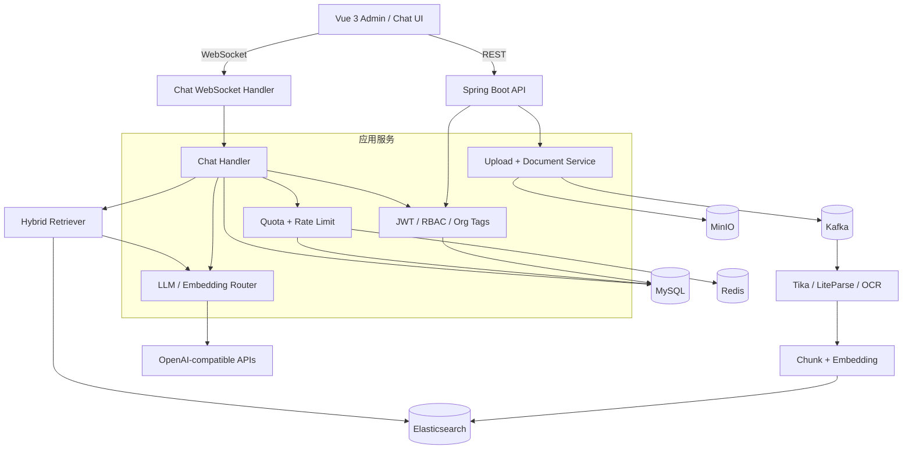
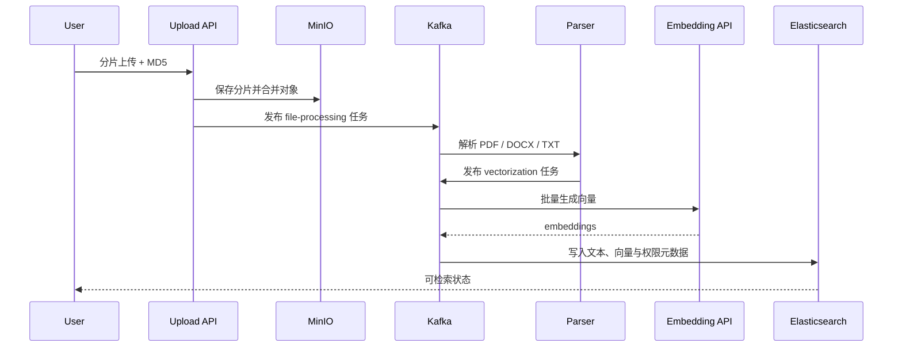

<div align="center">


# EwanSmart

<p><a href="README.md">English</a> · <strong>简体中文</strong> · <a href="README.zh-Hant.md">繁體中文</a></p>

### 面向团队知识库的全栈 RAG 问答与 AI 运营平台

[](https://spring.io/projects/spring-boot)
[](https://vuejs.org/)
[](https://www.elastic.co/)
[](LICENSE)

从文档上传、异步解析、向量化、混合检索，到带来源引用的 WebSocket 流式回答；再把多租户权限、模型路由、Token 配额、限流与运营看板放进同一套系统。

[真实运行](#真实运行) · [系统架构](#系统架构) · [核心链路](#核心链路) · [本地启动](#本地启动)

</div>

## 真实运行

以下页面来自本仓库在本地完整启动后的真实截图：Spring Boot 后端连接 MySQL、Redis、Kafka、MinIO 与 Elasticsearch，Vue 前端通过 REST / WebSocket 工作，并完成了真实模型调用。截图中的密钥只显示后端脱敏结果。

### 用量与风险一屏可见


一次真实对话后，系统记录了消息数、LLM Token、请求次数、额度预警、趋势图与用户排行。限流参数保存在后端，保存后对新请求即时生效。

<table>
  <tr>
    <td width="50%"></td>
    <td width="50%"></td>
  </tr>
  <tr>
    <td align="center"><b>模型路由</b><br>Provider、模型、地址、加密密钥与连通性测试</td>
    <td align="center"><b>Grounded RAG</b><br>空知识库时明确拒绝编造，并提示补充资料</td>
  </tr>
</table>

<details>
<summary>查看登录与运行时限流页面</summary>


</details>

## 这个系统解决什么

很多 RAG Demo 只完成“把文本塞进向量库再问一句”。EwanSmart 处理的是完整应用链路：

| 领域 | 实现能力 |
| --- | --- |
| 文档生命周期 | 分片上传、MD5 去重、合并、解析、切块、向量化、进度追踪、下载与预览 |
| 检索与回答 | 关键词 + 向量混合检索、上下文组装、来源映射、WebSocket 流式回答 |
| 异步可靠性 | Kafka 解耦文件处理与向量化，独立消费链路与死信队列 |
| 多租户 | 用户、组织标签、主组织、公开/私有文档与访问范围过滤 |
| 模型治理 | LLM / Embedding Provider 后台配置、加密存储、动态路由与危险切换保护 |
| 成本治理 | 用户余额、每日配额、全网 Token 预算、限流、告警、排行与趋势 |
| 平台运营 | 邀请码、注册模式、管理员引导、充值套餐与可选微信支付 |

## 系统架构



## 核心链路

### 文档进入知识库



### 一次有依据的回答

```text
用户问题
  → 身份与组织范围校验
  → 关键词 / 向量并行检索
  → 结果融合与上下文构建
  → Token 预算和限流检查
  → LLM 流式生成
  → 引用映射、会话持久化、用量记账
```

检索不到可信证据时，系统返回“暂无相关信息”，而不是让模型自由补全。这一点在上面的真实聊天截图中可以直接看到。

## 技术栈

| 层级 | 技术 |
| --- | --- |
| 后端 | Java 17、Spring Boot 3.4、Spring Security、Spring Data JPA、WebFlux、WebSocket |
| 前端 | Vue 3.5、TypeScript、Vite 6、Naive UI、Pinia、UnoCSS、ECharts |
| 数据 | MySQL 8、Redis、Elasticsearch 8.10 |
| 消息与对象存储 | Kafka、MinIO |
| 文档处理 | Apache Tika、LiteParse、Tesseract、可选阿里云 OCR |
| 模型 | OpenAI-compatible LLM / Embedding Provider |

## 关键设计

### Provider 配置不会回显明文密钥

后台只返回 `sk-****xxxx` 形式的掩码。新的 API Key 经 AES-GCM 加密后入库；留空表示保留现有值。Embedding Provider 切换会检查索引维度与重嵌入风险，避免在管理界面“一键切坏”知识库。

### 权限在检索前生效

文档记录同时保存 `userId`、`orgTag` 与 `isPublic`。查询不是先取回全部结果再在前端隐藏，而是在服务端构造可访问文件范围，确保私有知识不会进入模型上下文。

### 限流不只有 QPS

系统同时约束聊天消息次数、LLM 全网分钟/日 Token、Embedding 上传 Token、Embedding 查询次数和查询 Token；用量明细持久化到 MySQL，短周期状态由 Redis 承担，并在后台形成告警和排行。

## 本地启动

### 环境要求

- JDK 17+
- Maven 3.9+
- Node.js 18.20+
- pnpm 8.7+
- Docker Desktop / Docker Compose

### 1. 启动基础设施

```bash
git clone https://github.com/xuytwinter/EwanSmart.git
cd EwanSmart
docker compose -f docs/docker-compose.yaml up -d
docker compose -f docs/docker-compose.yaml ps
```

Compose 会启动并初始化 MySQL、Redis、Kafka、MinIO 与 Elasticsearch；首次启动 Elasticsearch 时会安装 IK 插件，因此健康状态可能需要等待一段时间。

### 2. 配置后端

```bash
# macOS / Linux
cp .env.example .env

# Windows PowerShell
Copy-Item .env.example .env
```

将 `.env` 中的基础设施配置改为与本地 Compose 一致，并填写模型配置：

```dotenv
SPRING_DATASOURCE_PASSWORD=EwanSmart2025
SPRING_DATA_REDIS_PASSWORD=EwanSmart2025

MINIO_ENDPOINT=http://localhost:19000
MINIO_PUBLIC_URL=http://localhost:19000
MINIO_ACCESS_KEY=admin
MINIO_SECRET_KEY=EwanSmart2025

ELASTICSEARCH_SCHEME=http
ELASTICSEARCH_USERNAME=elastic
ELASTICSEARCH_PASSWORD=EwanSmart2025
ELASTICSEARCH_INSECURE_TRUST_ALL_CERTIFICATES=false

# 必须是 Base64 编码后的 32 字节随机值
JWT_SECRET_KEY=replace-with-openssl-rand-base64-32

DEEPSEEK_API_URL=https://api.deepseek.com/v1
DEEPSEEK_API_MODEL=deepseek-chat
DEEPSEEK_API_KEY=your-llm-api-key

EMBEDDING_API_URL=https://dashscope.aliyuncs.com/compatible-mode/v1
EMBEDDING_API_MODEL=text-embedding-v4
EMBEDDING_API_KEY=your-embedding-api-key
```

生成本地密钥：

```bash
openssl rand -base64 32
```

`.env` 会由项目内的 `DotenvEnvironmentPostProcessor` 在 IDE、JAR 和 `mvn spring-boot:run` 场景自动读取。

### 3. 启动后端

```bash
mvn spring-boot:run
```

后端默认监听 `http://localhost:8081`。首次部署可临时开启管理员引导：

```dotenv
ADMIN_BOOTSTRAP_ENABLED=true
ADMIN_BOOTSTRAP_USERNAME=admin
ADMIN_BOOTSTRAP_PASSWORD=replace-with-a-strong-password
ADMIN_BOOTSTRAP_PRIMARY_ORG=default
ADMIN_BOOTSTRAP_ORG_TAGS=default,admin
```

创建成功后立即将 `ADMIN_BOOTSTRAP_ENABLED` 改回 `false`，并从 `.env` 删除引导密码。

### 4. 启动前端

```bash
cd frontend
pnpm install
pnpm dev
```

打开 `http://localhost:9527`。生产构建：

```bash
pnpm typecheck
pnpm build
```

## 配置入口

| 配置组 | 说明 |
| --- | --- |
| `APP_AUTH_*` / `ADMIN_BOOTSTRAP_*` | 注册模式、邀请码与首次管理员 |
| `SECURITY_ALLOWED_ORIGINS` | REST / WebSocket 跨域白名单 |
| `RATE_LIMIT_*` / `USAGE_QUOTA_*` | 请求与 Token 预算 |
| `KNOWLEDGE_BOOTSTRAP_*` | 启动时导入内置知识文档 |
| `FILE_PARSING_*` / `ALIYUN_OCR_*` | PDF 解析与 OCR |
| `AI_GENERATION_*` | 温度、max tokens、top-p |
| `WX_PAY_*` | 微信支付与充值开关 |

完整默认值见 `src/main/resources/application.yml` 与 `.env.example`。

## 测试与构建

```bash
# 后端测试与打包
mvn test
mvn package

# 前端类型检查与生产构建
cd frontend
pnpm typecheck
pnpm build
```

仓库还包含 WebSocket 重连 smoke test 和前端 Playwright 场景。涉及完整 RAG 的端到端验证需要先启动 Compose 基础设施及模型服务。

## 面试时可以聊什么

1. 为什么上传链路要拆成 MinIO、Kafka、解析和向量化四个阶段。
2. 混合检索如何与用户、组织和公开权限共同工作。
3. Provider 热切换为何对 LLM 开放、对 Embedding 更保守。
4. WebSocket 流式消息如何与会话持久化、Token 计量保持一致。
5. 分钟级限流、日配额和余额三种成本控制分别解决什么问题。
6. 如何处理重复上传、任务重试、死信队列与索引重建。

## 生产部署检查

- 替换 Compose 示例密码，限制 MySQL、Redis、Kafka、MinIO 与 Elasticsearch 的公网端口。
- 通过受保护的环境变量或密钥管理服务提供 JWT、模型与支付凭据。
- 将 `SECURITY_ALLOWED_ORIGINS` 收紧到真实域名，并在反向代理启用 HTTPS 与 WebSocket 转发。
- 关闭 Elasticsearch 不安全证书信任，建立 MySQL、MinIO 和索引备份策略。
- 验证 Kafka 死信队列、上传大小限制、限流告警和恢复流程。

## License

[MIT](LICENSE)
