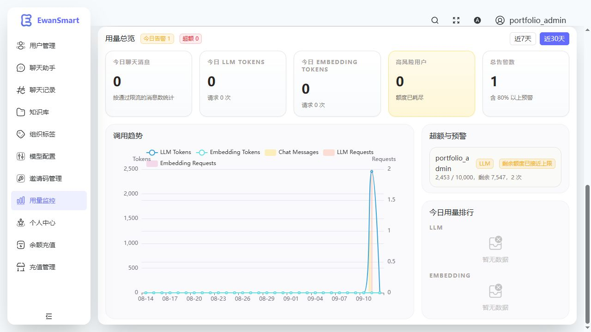
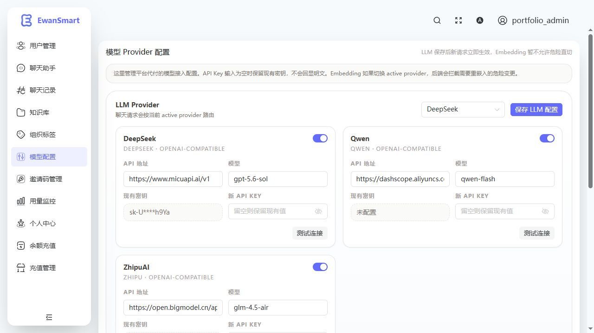
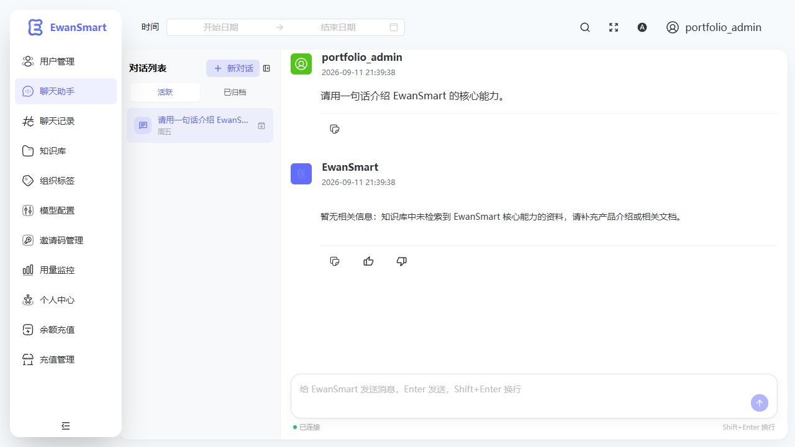
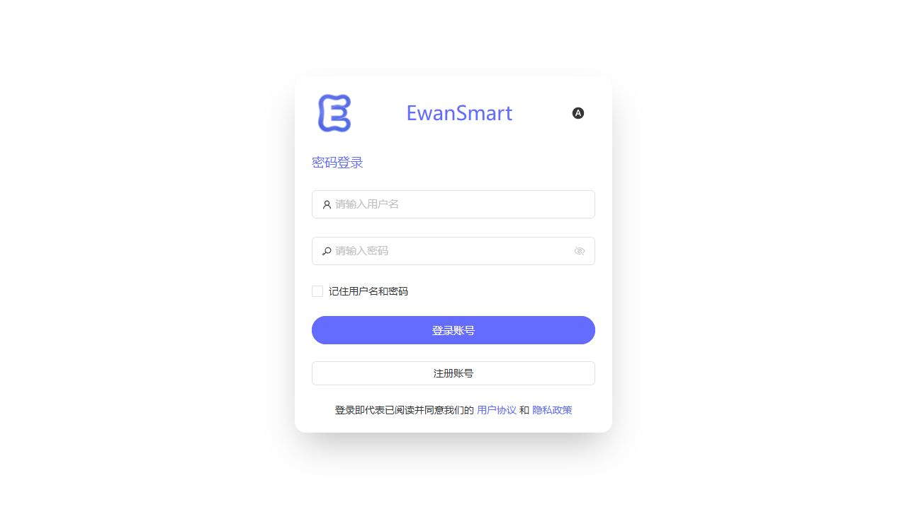
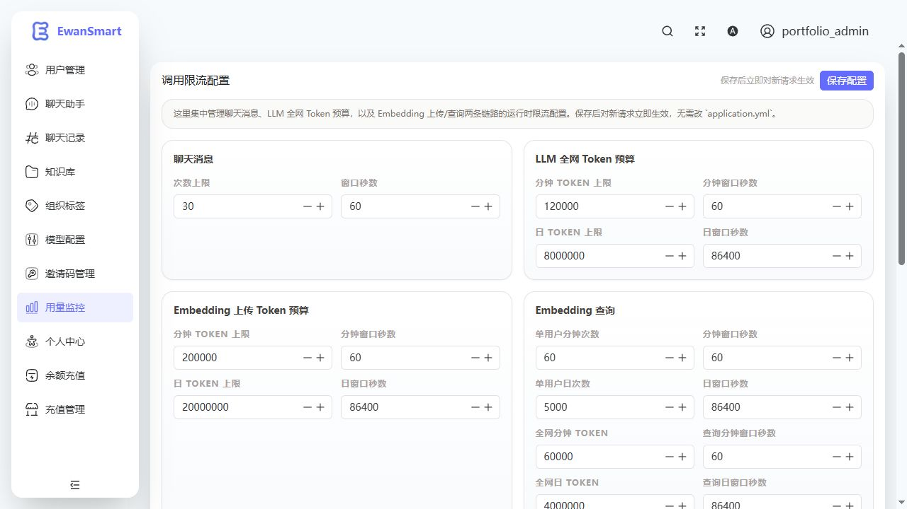
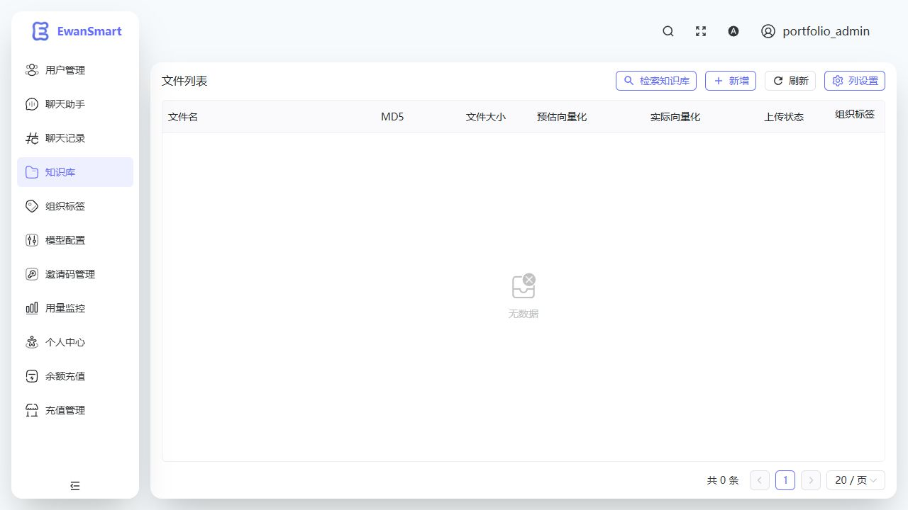
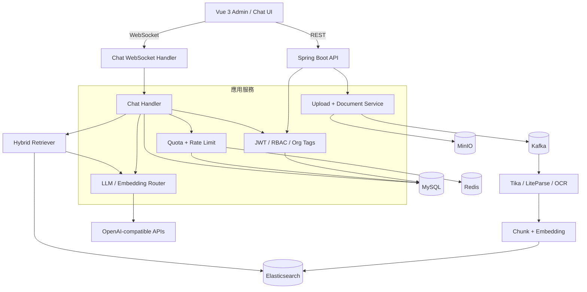
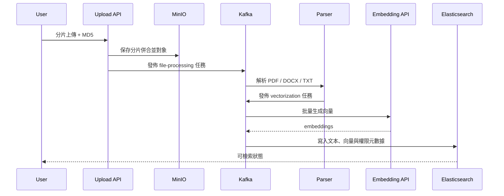

<div align="center">


# EwanSmart

<p><a href="README.md">English</a> · <a href="README.zh-CN.md">简体中文</a> · <strong>繁體中文</strong></p>

### 面向團隊知識庫的全棧 RAG 問答與 AI 運營平臺

[](https://spring.io/projects/spring-boot)
[](https://vuejs.org/)
[](https://www.elastic.co/)
[](LICENSE)

從文檔上傳、異步解析、向量化、混合檢索，到帶來源引用的 WebSocket 流式回答；再把多租戶權限、模型路由、Token 配額、限流與運營看板放進同一套系統。

[真實運行](#真實運行) · [系統架構](#系統架構) · [核心鏈路](#核心鏈路) · [本地啓動](#本地啓動)

</div>

## 真實運行

以下頁面來自本倉庫在本地完整啓動後的真實截圖：Spring Boot 後端連接 MySQL、Redis、Kafka、MinIO 與 Elasticsearch，Vue 前端通過 REST / WebSocket 工作，並完成了真實模型調用。截圖中的密鑰只顯示後端脫敏結果。

### 用量與風險一屏可見



一次真實對話後，系統記錄了消息數、LLM Token、請求次數、額度預警、趨勢圖與用戶排行。限流參數保存在後端，保存後對新請求即時生效。

<table>
  <tr>
    <td width="50%"></td>
    <td width="50%"></td>
  </tr>
  <tr>
    <td align="center"><b>模型路由</b><br>Provider、模型、地址、加密密鑰與連通性測試</td>
    <td align="center"><b>Grounded RAG</b><br>空知識庫時明確拒絕編造，並提示補充資料</td>
  </tr>
</table>

<details>
<summary>查看登錄與運行時限流頁面</summary>







</details>

## 這個系統解決什麼

很多 RAG Demo 只完成“把文本塞進向量庫再問一句”。EwanSmart 處理的是完整應用鏈路：

| 領域 | 實現能力 |
| --- | --- |
| 文檔生命週期 | 分片上傳、MD5 去重、合併、解析、切塊、向量化、進度追蹤、下載與預覽 |
| 檢索與回答 | 關鍵詞 + 向量混合檢索、上下文組裝、來源映射、WebSocket 流式回答 |
| 異步可靠性 | Kafka 解耦文件處理與向量化，獨立消費鏈路與死信隊列 |
| 多租戶 | 用戶、組織標籤、主組織、公開/私有文檔與訪問範圍過濾 |
| 模型治理 | LLM / Embedding Provider 後臺配置、加密存儲、動態路由與危險切換保護 |
| 成本治理 | 用戶餘額、每日配額、全網 Token 預算、限流、告警、排行與趨勢 |
| 平臺運營 | 邀請碼、註冊模式、管理員引導、充值套餐與可選微信支付 |

## 系統架構



## 核心鏈路

### 文檔進入知識庫



### 一次有依據的回答

```text
用戶問題
  → 身份與組織範圍校驗
  → 關鍵詞 / 向量並行檢索
  → 結果融合與上下文構建
  → Token 預算和限流檢查
  → LLM 流式生成
  → 引用映射、會話持久化、用量記賬
```

檢索不到可信證據時，系統返回“暫無相關信息”，而不是讓模型自由補全。這一點在上面的真實聊天截圖中可以直接看到。

## 技術棧

| 層級 | 技術 |
| --- | --- |
| 後端 | Java 17、Spring Boot 3.4、Spring Security、Spring Data JPA、WebFlux、WebSocket |
| 前端 | Vue 3.5、TypeScript、Vite 6、Naive UI、Pinia、UnoCSS、ECharts |
| 數據 | MySQL 8、Redis、Elasticsearch 8.10 |
| 消息與對象存儲 | Kafka、MinIO |
| 文檔處理 | Apache Tika、LiteParse、Tesseract、可選阿里雲 OCR |
| 模型 | OpenAI-compatible LLM / Embedding Provider |

## 關鍵設計

### Provider 配置不會回顯明文密鑰

後臺只返回 `sk-****xxxx` 形式的掩碼。新的 API Key 經 AES-GCM 加密後入庫；留空表示保留現有值。Embedding Provider 切換會檢查索引維度與重嵌入風險，避免在管理界面“一鍵切壞”知識庫。

### 權限在檢索前生效

文檔記錄同時保存 `userId`、`orgTag` 與 `isPublic`。查詢不是先取回全部結果再在前端隱藏，而是在服務端構造可訪問文件範圍，確保私有知識不會進入模型上下文。

### 限流不只有 QPS

系統同時約束聊天消息次數、LLM 全網分鐘/日 Token、Embedding 上傳 Token、Embedding 查詢次數和查詢 Token；用量明細持久化到 MySQL，短週期狀態由 Redis 承擔，並在後臺形成告警和排行。

## 本地啓動

### 環境要求

- JDK 17+
- Maven 3.9+
- Node.js 18.20+
- pnpm 8.7+
- Docker Desktop / Docker Compose

### 1. 啓動基礎設施

```bash
git clone https://github.com/xuytwinter/EwanSmart.git
cd EwanSmart
docker compose -f docs/docker-compose.yaml up -d
docker compose -f docs/docker-compose.yaml ps
```

Compose 會啓動並初始化 MySQL、Redis、Kafka、MinIO 與 Elasticsearch；首次啓動 Elasticsearch 時會安裝 IK 插件，因此健康狀態可能需要等待一段時間。

### 2. 配置後端

```bash
# macOS / Linux
cp .env.example .env

# Windows PowerShell
Copy-Item .env.example .env
```

將 `.env` 中的基礎設施配置改爲與本地 Compose 一致，並填寫模型配置：

```dotenv
SPRING_DATASOURCE_PASSWORD=EwanSmart2025
SPRING_DATA_REDIS_PASSWORD=EwanSmart2025

MINIO_ENDPOINT=http://localhost:19000
MINIO_PUBLIC_URL=http://localhost:19000
MINIO_ACCESS_KEY=admin
MINIO_SECRET_KEY=EwanSmart2025

ELASTICSEARCH_SCHEME=http
ELASTICSEARCH_USERNAME=elastic
ELASTICSEARCH_PASSWORD=EwanSmart2025
ELASTICSEARCH_INSECURE_TRUST_ALL_CERTIFICATES=false

# 必須是 Base64 編碼後的 32 字節隨機值
JWT_SECRET_KEY=replace-with-openssl-rand-base64-32

DEEPSEEK_API_URL=https://api.deepseek.com/v1
DEEPSEEK_API_MODEL=deepseek-chat
DEEPSEEK_API_KEY=your-llm-api-key

EMBEDDING_API_URL=https://dashscope.aliyuncs.com/compatible-mode/v1
EMBEDDING_API_MODEL=text-embedding-v4
EMBEDDING_API_KEY=your-embedding-api-key
```

生成本地密鑰：

```bash
openssl rand -base64 32
```

`.env` 會由項目內的 `DotenvEnvironmentPostProcessor` 在 IDE、JAR 和 `mvn spring-boot:run` 場景自動讀取。

### 3. 啓動後端

```bash
mvn spring-boot:run
```

後端默認監聽 `http://localhost:8081`。首次部署可臨時開啓管理員引導：

```dotenv
ADMIN_BOOTSTRAP_ENABLED=true
ADMIN_BOOTSTRAP_USERNAME=admin
ADMIN_BOOTSTRAP_PASSWORD=replace-with-a-strong-password
ADMIN_BOOTSTRAP_PRIMARY_ORG=default
ADMIN_BOOTSTRAP_ORG_TAGS=default,admin
```

創建成功後立即將 `ADMIN_BOOTSTRAP_ENABLED` 改回 `false`，並從 `.env` 刪除引導密碼。

### 4. 啓動前端

```bash
cd frontend
pnpm install
pnpm dev
```

打開 `http://localhost:9527`。生產構建：

```bash
pnpm typecheck
pnpm build
```

## 配置入口

| 配置組 | 說明 |
| --- | --- |
| `APP_AUTH_*` / `ADMIN_BOOTSTRAP_*` | 註冊模式、邀請碼與首次管理員 |
| `SECURITY_ALLOWED_ORIGINS` | REST / WebSocket 跨域白名單 |
| `RATE_LIMIT_*` / `USAGE_QUOTA_*` | 請求與 Token 預算 |
| `KNOWLEDGE_BOOTSTRAP_*` | 啓動時導入內置知識文檔 |
| `FILE_PARSING_*` / `ALIYUN_OCR_*` | PDF 解析與 OCR |
| `AI_GENERATION_*` | 溫度、max tokens、top-p |
| `WX_PAY_*` | 微信支付與充值開關 |

完整默認值見 `src/main/resources/application.yml` 與 `.env.example`。

## 測試與構建

```bash
# 後端測試與打包
mvn test
mvn package

# 前端類型檢查與生產構建
cd frontend
pnpm typecheck
pnpm build
```

倉庫還包含 WebSocket 重連 smoke test 和前端 Playwright 場景。涉及完整 RAG 的端到端驗證需要先啓動 Compose 基礎設施及模型服務。

## 面試時可以聊什麼

1. 爲什麼上傳鏈路要拆成 MinIO、Kafka、解析和向量化四個階段。
2. 混合檢索如何與用戶、組織和公開權限共同工作。
3. Provider 熱切換爲何對 LLM 開放、對 Embedding 更保守。
4. WebSocket 流式消息如何與會話持久化、Token 計量保持一致。
5. 分鐘級限流、日配額和餘額三種成本控制分別解決什麼問題。
6. 如何處理重複上傳、任務重試、死信隊列與索引重建。

## 生產部署檢查

- 替換 Compose 示例密碼，限制 MySQL、Redis、Kafka、MinIO 與 Elasticsearch 的公網端口。
- 通過受保護的環境變量或密鑰管理服務提供 JWT、模型與支付憑據。
- 將 `SECURITY_ALLOWED_ORIGINS` 收緊到真實域名，並在反向代理啓用 HTTPS 與 WebSocket 轉發。
- 關閉 Elasticsearch 不安全證書信任，建立 MySQL、MinIO 和索引備份策略。
- 驗證 Kafka 死信隊列、上傳大小限制、限流告警和恢復流程。

## License

[MIT](LICENSE)
